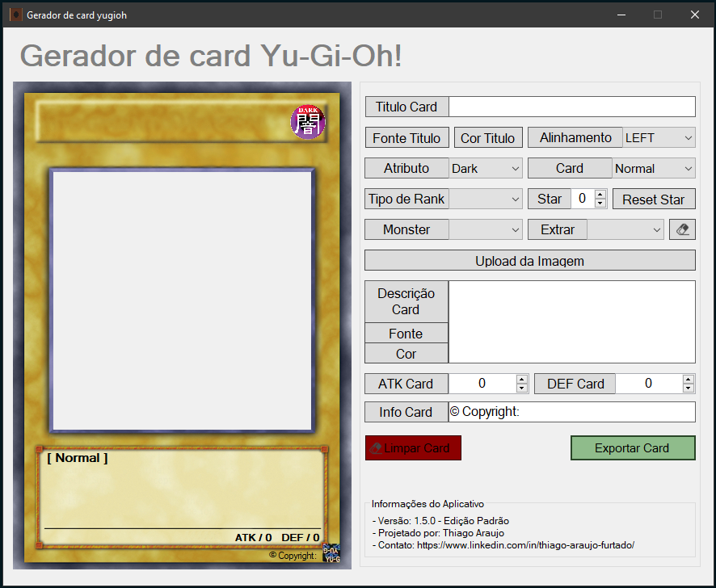
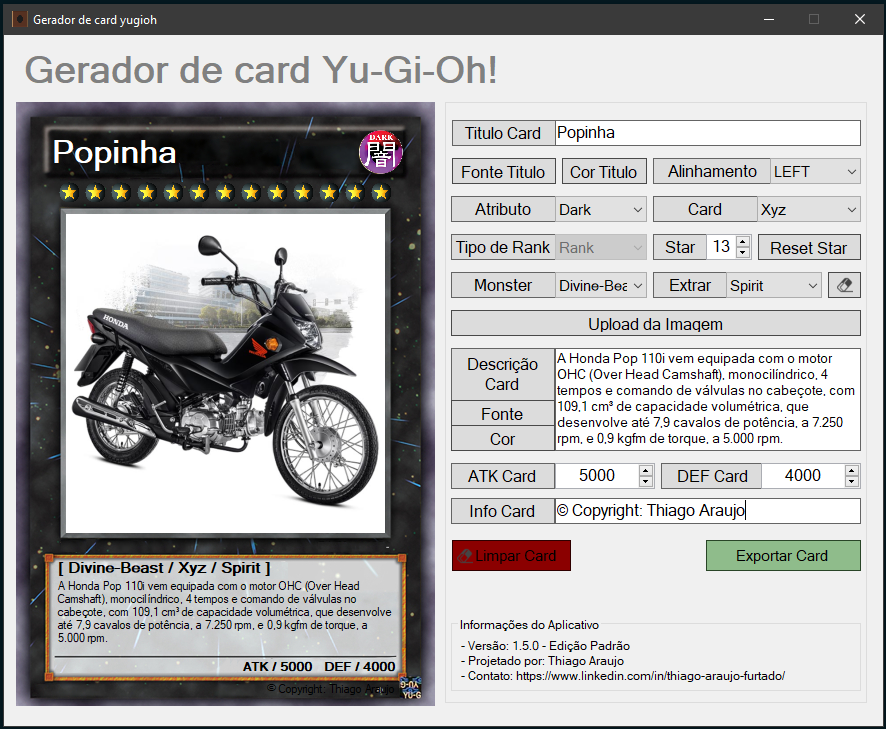
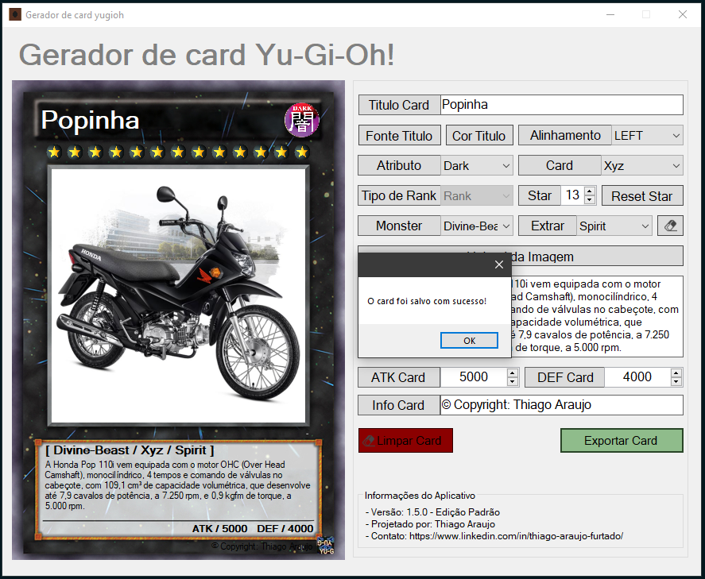
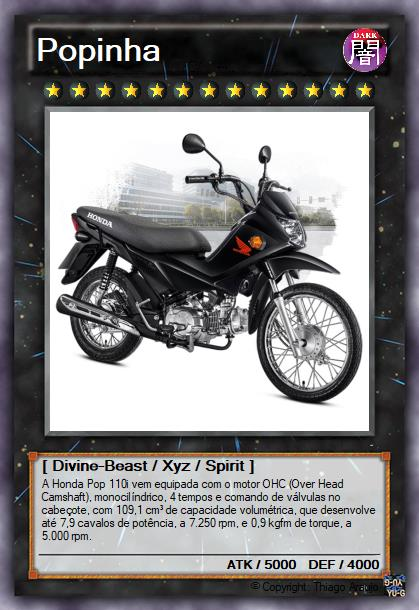

<h1 align="center">
    <a href="#" alt="gerador de card"> Gerador de card Yu-Gi-Oh! </a>
</h1>

<h3 align="center">
    Criar cards do Yu-Gi-Oh! do zero fácil e prático.
</h3>

  

  

  
  
  
    
   
   
 

<h4 align="center">
	🚧 Concluído 🚧
</h4>

Tabela de conteúdos
=================
<!--ts-->
   * [Sobre o projeto](#-sobre-o-projeto)
   * [Funcionalidades](#-funcionalidades)
   * [Layout](#-layout)
     * [Desktop](#Desktop)
   * [Tecnologias](#-tecnologias)
     * [Desktop](#user-content-website--Desktop----typescript)
   * [Autor](#-autor)
   * [Licença](#user-content--licença)
<!--te-->

## 💻 Sobre o projeto

Yugioh-Card-Maker - é uma forma de criar cards do Yu-Gi-Oh! de maneira prática rápido e fácil.

---

## ⚙️ Funcionalidades

- [x] Gerador de Card:
  - [x] Criar card 
    - Título Card
    - Fonte Título
    - Cor Título
    - Alinhamento Título
    - Atributo
    - Card
    - Tipo de Rank
    - Star
    - Reset Star
    - Monster
    - Extrar
    - Upload da Imagem
    - Descrição Card
    - Fonte Card
    - Cor Card
    - ATK Card
    - DEF Card
    - Info Card
  - [x] Limpar Card
    - Limpa todos os campos
  - [x] Exportar Card
    - Exportar o card no formato de imagem
  - [x] Informações do Aplicativo: 
    - Info sobre o projeto

---

## 🎨 Layout

O layout da aplicação é simples e prático.

### Desktop

  

  

  

  

---

## 🛠 Tecnologias

As seguintes ferramentas foram usadas na construção do projeto:

#### **Desktop**  ([c#](https://docs.microsoft.com/pt-br/dotnet/csharp/)  +  [Windows Forms](https://docs.microsoft.com/pt-br/visualstudio/ide/create-csharp-winform-visual-studio?view=vs-2019))

-   **[C# itextsharp](https://www.nuget.org/packages/iTextSharp/)**

> Veja o arquivo  [packages.config](https://github.com/lThiag0/Yugioh-Card-Maker/tree/master/PRBIrelatorio/packages.config)

#### **Utilitários**

-   Editor:  **[Visual Studio](https://visualstudio.microsoft.com/pt-br/)**  → And:  **[Visual Studio Code](https://code.visualstudio.com/)**
-   Commit Conventional:  **[Commitlint](https://github.com/conventional-changelog/commitlint)**

---

## 🦸 Autor

<a href="#">
 
  
 <b>Thiago Araujo</b></a> <a href="#" title="Coding">Code</a>
  

  

---

## 📝 Licença

Este projeto esta sobe a licença [MIT](./LICENSE).

Feito com ❤️ por Thiago Araujo 👋🏽 [Entre em contato!](https://www.linkedin.com/in/thiago-araujo-furtado/)
